<p align="center">
  
</p>

<h1 align="center">Memory-Augmented Brain Encoding</h1>

<p align="center">
  <em>Extending TRIBE v2 with a content-based long-range memory module for narrative fMRI encoding.</em>
</p>

<p align="center">
  
  
  
  
  
  
</p>

---

## Overview

Encoding models predict brain activity from the stimulus a person is experiencing. The current state of the art for naturalistic movie-watching fMRI is **TRIBE v2**, the model that won 1st place out of 263 teams in the **Algonauts 2025** challenge. TRIBE v2 fuses video, audio, and text features through a transformer encoder and predicts activity across the cortical surface.

But TRIBE v2 sees the stimulus through a **fixed, local window**. Narrative comprehension is not local: understanding a scene depends on plot context accumulated over minutes. Higher-order cortex (default-mode and frontoparietal control networks) is known to integrate information over long timescales — the *temporal receptive window* (TRW) hierarchy.

This project asks a focused question:

> **Does adding learned, content-based memory over past context improve encoding — and where in cortex does it help most?**

We add a lightweight **memory module** to TRIBE v2 that stores compressed summaries of past context windows and retrieves the relevant ones via cross-attention. It is inserted with a **zero-initialised gate**, so training begins as exactly vanilla TRIBE v2 and only "opens" the gate where past context measurably improves prediction.

---

## Architecture

<p align="center">
  
</p>

The module is a drop-in insertion in the TRIBE v2 forward pass, between the transformer encoder and the low-rank prediction head:

```
aggregate_features()   -> [B, T, 1152]      multimodal stimulus features
transformer_forward()  -> [B, T, 1152]      contextual encoding
>>> MEMORY MODULE <<<                        retrieve + integrate past context
low_rank_head()        -> [B, T, 2048]
predictor()            -> [B, 20484, T]      activity over 20,484 cortical vertices
```

### How the memory works

<p align="center">
  
</p>

The mechanism has three parts (see [`src/memory.py`](src/memory.py)):

1. **Memory buffer** — a per-timeline FIFO buffer. Each context window's transformer output is mean-pooled across time into a single summary vector and stored. The buffer is reset between movies so context never leaks across stimuli.
2. **Cosine retrieval** — the current window is mean-pooled into a query and matched against the buffer by cosine similarity; the **top-k** most relevant past summaries are retrieved.
3. **Gated cross-attention** — the current window (queries) attends to the retrieved memories (keys/values) through multi-head cross-attention, and the result is added back through a **learnable gate** `tanh(g)`. Because `g` is initialised to 0, the module starts as an identity map — it can only help, never hurt the baseline at initialisation.

---

## Key findings

> All numbers are from the rigorous rebuild (leakage-controlled, fixed capacity). Raw fMRI encoding correlations are modest by nature; the headline metric is **ΔR**, the change in per-parcel correlation from adding memory over an otherwise identical baseline.

| Result | Value |
| --- | --- |
| Cortical parcels improved by memory | **61.4%** |
| Mean memory benefit, ΔR (memory − baseline) | **+0.026** |
| Best ablation configuration, ΔR | **+0.033** |
| Parameters (memory model / baseline) | **2.7M / 4.7M** |

**Memory helps, and it helps cheaply.** A majority of cortical parcels are predicted better with memory, and the gain is concentrated where the TRW hypothesis predicts — association cortex rather than early sensory areas (mapped onto the 7 Yeo networks via the Schaefer-1000 atlas).

**The optimal configuration is small.** Ablations (memory size, attention heads, gate type, hidden dim, sequence length) point to a compact sweet spot — **256 hidden dim, 8 memory slots, 2 attention heads, learned gate** — which delivers the best ΔR while using *fewer* parameters than the baseline. Memory adds capability, not bulk.

**It transfers.** The optimal model, trained longer (50 epochs) on the main stimuli, retains its memory benefit when evaluated on held-out **Movie10** data — the gain is not an artifact of one stimulus set.

### Temporal context sweep

Before adding *learned* memory, we establish the effect with a clean **fixed-window** control: hold model capacity constant (same 250 PCA features, same ridge regression) and vary only the integration length `L ∈ {1, 2, 4, 8, 16, 32, 64, 100}` TRs. Any change in prediction is then attributable to temporal integration alone. This sweep is the motivation for the learned module — it shows association networks continuing to benefit from longer context where sensory networks plateau, which is exactly the regime a learned, content-based memory should exploit.

---

## Experimental design

This is a deliberate rebuild of an earlier version that had methodological flaws (circular features, an unfair per-TR baseline). The current design is built to survive review:

- **No temporal leakage** — train/test are split by *episode*; no TR from a test episode appears in training, and causal pooling never crosses episode boundaries.
- **Fixed capacity across conditions** — the temporal sweep changes only `L`; nothing else, so differences cannot be explained by model size.
- **Honest baseline** — the memory model is compared against an otherwise identical no-memory model, not a strawman.
- **Noise-ceiling normalisation** — raw correlations are divided by a per-parcel inter-subject noise ceiling to report fraction of *explainable* variance, with significance tested across subjects/episodes.
- **One factor at a time** — every ablation varies a single hyperparameter against fixed defaults.

---

## Repository structure

```
memory-augmented-brain-encoding/
├── notebooks/
│   ├── 00_data_setup_and_alignment.ipynb        Data download + stimulus/fMRI alignment
│   ├── 01_setup_and_first_prediction.ipynb       Pipeline smoke test, first predictions
│   ├── 01_temporal_integration_sweep.ipynb       Fixed-window L sweep (TRW hierarchy)
│   ├── 02_baseline_reproduction.ipynb            TRIBE v2 baseline encoding scores
│   ├── 03_memory_module.ipynb                     Memory module integration
│   ├── 04_training.ipynb                          Training loop
│   ├── 05_real_fmri_training.ipynb                Training on real fMRI
│   ├── 06_real_fmri_day6.ipynb                    Real fMRI continued
│   ├── Day7_TRIBE_Feature_Extraction_and_Encoding_v2.ipynb
│   ├── Day8_Real_fMRI_Encoding.ipynb              Per-parcel memory benefit
│   ├── Day9_Network_Mapping.ipynb                 Schaefer / Yeo network mapping
│   ├── Day10_Real_Features_Encoding.ipynb         Real multimodal features → fMRI
│   ├── Day11_Ablation_Studies.ipynb               Ablations (size, heads, gate, dim, seq)
│   ├── Day12_Optimal_and_Transfer.ipynb           Optimal config + Movie10 transfer
│   └── run_all_brain_encoding.ipynb               End-to-end driver
├── src/
│   └── memory.py                                  MemoryBuffer · MemoryAttention · MemoryAugmentedEncoder
├── brain-encoding-banner.svg
├── architecture.svg
├── memory-module.svg
└── README.md
```

---

## Dataset

[**Algonauts 2025**](https://algonautsproject.com/) naturalistic movie-watching fMRI:

- 4 subjects, ~66 hours of fMRI per subject (an unusually large per-subject dataset)
- Stimuli: the TV series *Friends* plus several movies
- BOLD activity sampled at ~1.49 s/TR over **20,484 cortical vertices** (fsaverage5 surface)
- Pre-extracted multimodal stimulus features from the TRIBE v2 encoders

> The dataset is not redistributed here. See the Algonauts 2025 project for access and terms.

---

## Getting started

> Notebooks are written for Google Colab with an A100 GPU. Feature extraction and training are GPU-heavy; the network-mapping and analysis notebooks run on CPU.

```bash
git clone https://github.com/Mrabbi3/memory-augmented-brain-encoding.git
cd memory-augmented-brain-encoding

python -m venv .venv && source .venv/bin/activate
pip install torch nilearn numpy scipy scikit-learn pandas matplotlib
```

Suggested order:

1. `notebooks/00_data_setup_and_alignment.ipynb` — fetch and align data
2. `notebooks/02_baseline_reproduction.ipynb` — reproduce the TRIBE v2 baseline
3. `notebooks/01_temporal_integration_sweep.ipynb` — the fixed-window motivation
4. `notebooks/Day10_Real_Features_Encoding.ipynb` — memory vs. baseline on real features
5. `notebooks/Day11_Ablation_Studies.ipynb` → `Day12_Optimal_and_Transfer.ipynb` — what makes memory work, and whether it transfers

The memory module itself is standalone in `src/memory.py` and can wrap any TRIBE-style encoder:

```python
from src.memory import MemoryAugmentedEncoder

memory_encoder = MemoryAugmentedEncoder(tribe_model._model, buffer_size=8, top_k=5, num_heads=2)

for window_batch in timeline_windows:
    predictions = memory_encoder.forward_with_memory(window_batch)

memory_encoder.reset_memory()  # call between movies/timelines
```

---

## Status and limitations

This is active research, with a manuscript **in preparation**. Honest caveats:

- Absolute encoding correlations are modest — expected for naturalistic fMRI — so results are reported as ΔR over a matched baseline and as noise-ceiling-normalised explainable variance.
- The cortical map is correlational; it suggests *where* longer context helps, not a mechanistic claim about hippocampal computation.
- Subject and stimulus counts are small relative to typical ML datasets; the transfer test (Movie10) is one guardrail against overfitting, not a final word.

---

## Roadmap

- [x] Leakage-controlled temporal integration sweep
- [x] Memory module with gated cross-attention (`src/memory.py`)
- [x] Per-parcel memory benefit and Schaefer/Yeo network mapping
- [x] Ablations and optimal configuration
- [x] Cross-task transfer (Movie10)
- [ ] Noise-ceiling-normalised cortical hierarchy map with significance testing
- [ ] Multi-subject scaling and confidence intervals
- [ ] Manuscript submission

---

## Acknowledgements

Built on **TRIBE v2** (Algonauts 2025 winning model) and the **Algonauts 2025** dataset. Schaefer-2018 / Yeo 7-network parcellation via [nilearn](https://nilearn.github.io/).

Advised by **Prof. Helen Wei**, Stockton University.

## Citation

If this work is useful to you:

```bibtex
@software{rabbi_memory_augmented_brain_encoding,
  author = {Rabbi, MD},
  title  = {Memory-Augmented Brain Encoding: Extending TRIBE v2 with Long-Range Memory},
  year   = {2026},
  url    = {https://github.com/Mrabbi3/memory-augmented-brain-encoding}
}
```

## License

Released under the MIT License — add a `LICENSE` file to the repo to make this explicit.

---

<p align="center"><sub>Author: MD Rabbi · Stockton University · diagrams are schematic and intended for intuition, not to scale.</sub></p>
